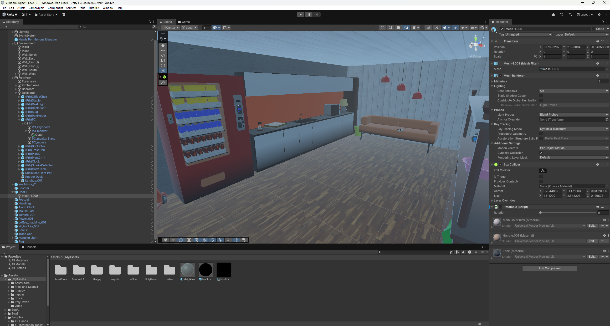
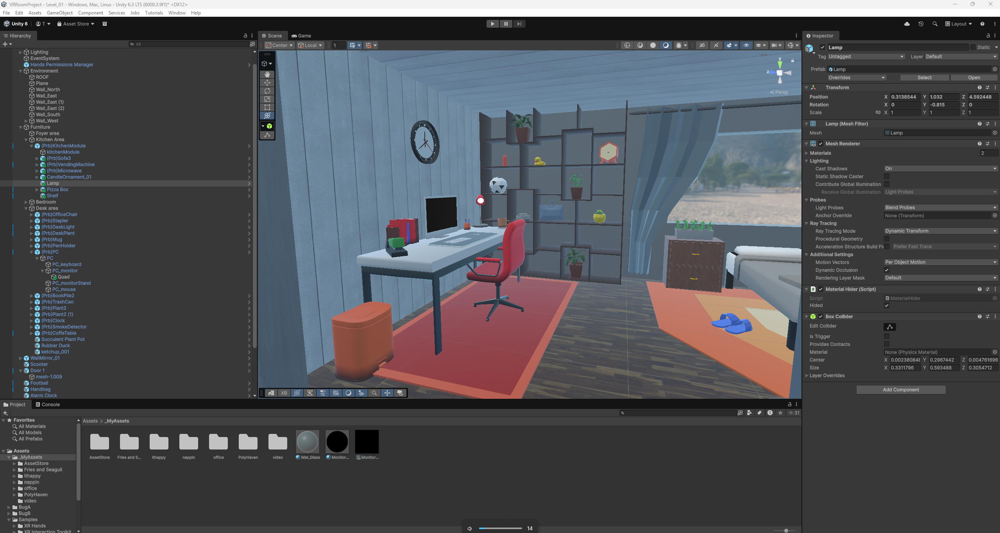
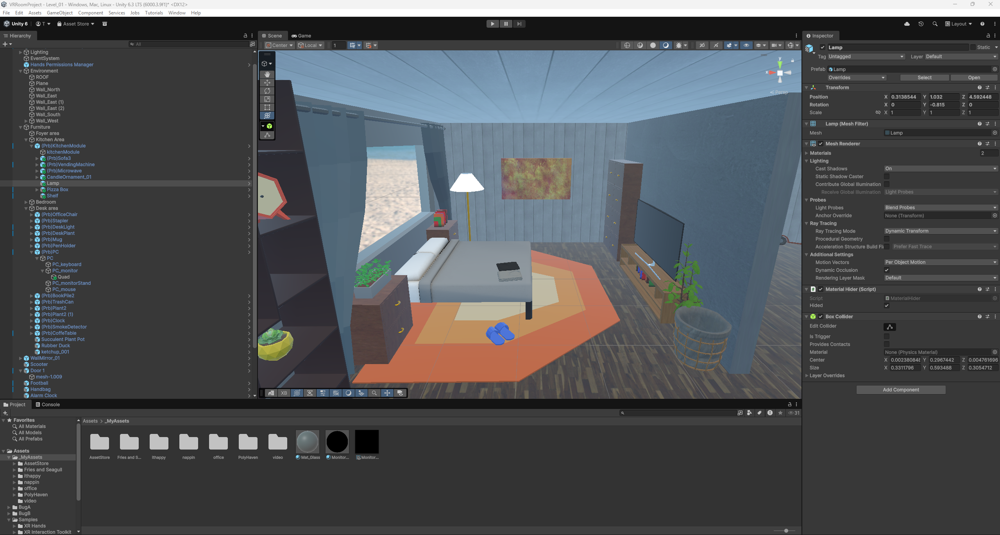

3D VR Bedroom Assignment README

This project is a representation of a calming beachside single bedroom home that I have constructed in VR! With the use of AI coding, I have added a video to be displayed, playing on the face of my pc monitor asset. 

## Gameplay Screenshots

## Asset Credits

I'm not sure how to use direct links to my assets but I used:

Unity Asset Store:
Low Poly Bedroom Asset Pack
MinimalistBedroom
Fries and Seagull Interior 04E
ithappy Furniture_FREE
nappin HouseInteriorPack
office OfficeEssentialsPack

PolyHaven:
Beige_wall_001_2k
Mat_Skybox
Plank_flooring_2k
Plastered_wall_02_2k
Spiaggia_di_mondello_2k

Video:
Minecraft Movie Final Trailer